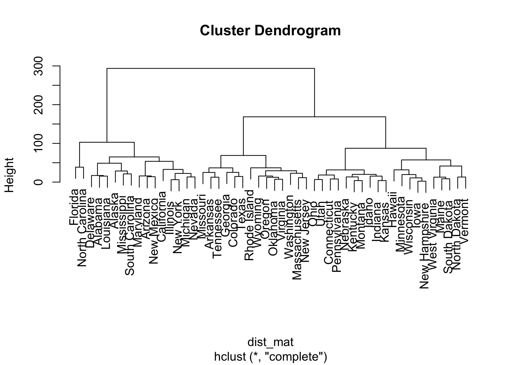
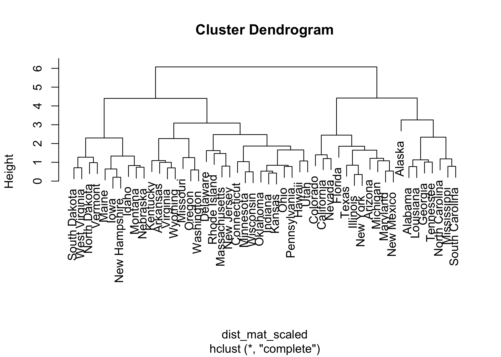

P8106 Data Science II Homework 5
================
Sarah Forrest - sef2183
5/5/2023

# 1. Predicting gas milage using the auto dataset

In this problem, we will apply support vector machines to predict
whether a given car gets high or low gas mileage based on the dataset
“auto.csv”. The dataset contains 392 observations. The response variable
is `mpg_cat`, which indicates whether the miles per gallon of a car is
high or low. The predictors are `cylinders`, `displacement`,
`horsepower`, `weight`, `acceleration`, `year`, and `origin`.

``` r
# read in data
auto = read.csv("data/auto.csv") 
```

Create dummy variables for `origin` (1 = American, 2 = European, 3 =
Japanese) so it will be treated as a character variable rather than a
numeric variable. Two dummy variables are created: one for American cars
(1 = American, 0 = otherwise) and one for European cars (1 = European, 0
= otherwise). Note that cars with Japanese origin have a value of 0 for
both `origin_american` and `origin_european` dummy variables.

``` r
auto$origin_american <- ifelse(auto$origin == 1, 1, 0) # dummy variable for american origin (origin = 1)
auto$origin_european <- ifelse(auto$origin == 2, 1, 0) # dummy variable for european origin (origin = 2)

# remove original origin variable
auto$origin <- NULL
```

Mutate the data so the outcome variable `mpg_cat` takes numeric values
of 0 and 1 rather than character values “low” and “high”

``` r
auto = 
  auto %>%
  mutate(mpg_cat = case_when(
    mpg_cat == "low" ~ 0,
    mpg_cat == "high" ~ 1))
```

Split the dataset into two parts: training data (70%) and test data
(30%)

``` r
set.seed(1) # for reproducibility

# specify rows of training data (70% of the dataset)
rowTrain <- createDataPartition(y = auto$mpg_cat, 
                              p = .7,
                              list = F)

# create training dataset
auto_train <- auto[rowTrain, ]

# create test dataset
auto_test <- auto[-rowTrain, ]
```

## (a) Fit a support vector classifier (linear kernel) to the training data.

``` r
svm_model_lin <- svm(mpg_cat ~ ., data = auto_train, kernel = "linear")

# print the model summary
summary(svm_model_lin)
## 
## Call:
## svm(formula = mpg_cat ~ ., data = auto_train, kernel = "linear")
## 
## 
## Parameters:
##    SVM-Type:  eps-regression 
##  SVM-Kernel:  linear 
##        cost:  1 
##       gamma:  0.125 
##     epsilon:  0.1 
## 
## 
## Number of Support Vectors:  170
```

### Training error rate

``` r
# predict the support vector classifier (linear kernel) on the training data
train_pred_lin <- predict(svm_model_lin, newdata = auto_train)

# compute the training error rate
train_error_rate_lin <- mean(train_pred_lin != auto_train$mpg_cat)
train_error_rate_lin
## [1] 1
```

### Test error rate

``` r
# predict the support vector classifier (linear kernel) on the test data
test_pred_lin <- predict(svm_model_lin, newdata = auto_test)

# compute the test error rate
test_error_rate_lin <- mean(test_pred_lin != auto_test$mpg_cat)
test_error_rate_lin
## [1] 1
```

# (b) Fit a support vector machine with a radial kernel to the training data.

``` r
svm_model_rad <- svm(mpg_cat ~ ., data = auto_train, kernel = "radial")

# print the model summary
summary(svm_model_rad)
## 
## Call:
## svm(formula = mpg_cat ~ ., data = auto_train, kernel = "radial")
## 
## 
## Parameters:
##    SVM-Type:  eps-regression 
##  SVM-Kernel:  radial 
##        cost:  1 
##       gamma:  0.125 
##     epsilon:  0.1 
## 
## 
## Number of Support Vectors:  110
```

### Training error rate

``` r
# predict the support vector machine (radial kernel) on the training data
train_pred_rad <- predict(svm_model_rad, newdata = auto_train)

# compute the training error rate
train_error_rate_rad <- mean(train_pred_rad != auto_train$mpg_cat)
train_error_rate_rad
## [1] 1
```

### Test error rate

``` r
# predict the support vector machine (radial kernel) on the test data
test_pred_rad <- predict(svm_model_rad, newdata = auto_test)

# compute the test error rate
test_error_rate_rad <- mean(test_pred_rad != auto_test$mpg_cat)
test_error_rate_rad
## [1] 1
```

# 2. Hierarchical clustering on the states using the USArrests dataset

In this problem, we perform hierarchical clustering on the states using
the USArrests data in the ISLR package. For each of the 50 states in the
United States, the dataset contains the number of arrests per 100,000
residents for each of three crimes: Assault, Murder, and Rape. The
dataset also contains the percent of the population in each state living
in urban areas, UrbanPop. The four variables will be used as features
for clustering.

``` r
# read in data
arrests <- data.frame(USArrests)
```

## (a) Using hierarchical clustering with complete linkage and Euclidean distance, cluster the states. Cut the dendrogram at a height that results in three distinct clusters.

``` r
set.seed(1)

# compute the euclidean distance matrix
dist_mat <- dist(arrests, method = "euclidean")

# perform hierarchical clustering with complete linkage
hc <- hclust(dist_mat, method = "complete") # complete linkage

# plot
plot(hc)
```

<!-- -->

``` r
# cut the dendrogram at a height that results in three distinct clusters
hc_clusters <- cutree(hc, k = 3) # three clusters

# print the states in each cluster
cat("Cluster 1:", row.names(arrests[hc_clusters == 1,]))
## Cluster 1: Alabama Alaska Arizona California Delaware Florida Illinois Louisiana Maryland Michigan Mississippi Nevada New Mexico New York North Carolina South Carolina
cat("Cluster 2:", row.names(arrests[hc_clusters == 2,]))
## Cluster 2: Arkansas Colorado Georgia Massachusetts Missouri New Jersey Oklahoma Oregon Rhode Island Tennessee Texas Virginia Washington Wyoming
cat("Cluster 3:", row.names(arrests[hc_clusters == 3,]))
## Cluster 3: Connecticut Hawaii Idaho Indiana Iowa Kansas Kentucky Maine Minnesota Montana Nebraska New Hampshire North Dakota Ohio Pennsylvania South Dakota Utah Vermont West Virginia Wisconsin
```

**Cluster 1** The states in cluster 1 include: Alabama, Alaska, Arizona,
California, Delaware, Florida, Illinois, Louisiana, Maryland, Michigan,
Mississippi, Nevada, New Mexico, New York, North Carolina, and South
Carolina.

**Cluster 2** The states in cluster 2 include: Arkansas, Colorado,
Georgia, Massachusetts, Missouri, New Jersey, Oklahoma, Oregon, Rhode
Island, Tennessee, Texas, Virginia, Washington, and Wyoming.

**Cluster 3** The states in cluster 3 include: Connecticut, Hawaii,
Idaho, Indiana, Iowa, Kansas, Kentucky, Maine, Minnesota, Montana,
Nebraska, New Hampshire, North Dakota, Ohio, Pennsylvania, South Dakota,
Utah, Vermont, West Virginia, and Wisconsin.

## (b) Hierarchically cluster the states using complete linkage and Euclidean distance, after scaling the variables to have standard deviation one.

``` r
# scale the variables
arrests_scaled <- scale(arrests)

set.seed(1)

# compute the Euclidean distance matrix
dist_mat_scaled <- dist(arrests_scaled, method = "euclidean")

# perform hierarchical clustering with complete linkage
hc_scaled <- hclust(dist_mat_scaled, method = "complete") # complete linkage

# plot
plot(hc_scaled)
```

<!-- -->

``` r
# cut the dendrogram at a height that results in three distinct clusters
hc_clusters_scaled <- cutree(hc_scaled, k = 3) # three clusters

# print the states in each cluster
cat("Cluster 1:", row.names(arrests[hc_clusters_scaled == 1,]))
## Cluster 1: Alabama Alaska Georgia Louisiana Mississippi North Carolina South Carolina Tennessee
cat("Cluster 2:", row.names(arrests[hc_clusters_scaled == 2,]))
## Cluster 2: Arizona California Colorado Florida Illinois Maryland Michigan Nevada New Mexico New York Texas
cat("Cluster 3:", row.names(arrests[hc_clusters_scaled == 3,]))
## Cluster 3: Arkansas Connecticut Delaware Hawaii Idaho Indiana Iowa Kansas Kentucky Maine Massachusetts Minnesota Missouri Montana Nebraska New Hampshire New Jersey North Dakota Ohio Oklahoma Oregon Pennsylvania Rhode Island South Dakota Utah Vermont Virginia Washington West Virginia Wisconsin Wyoming
```

**Cluster 1** The states in cluster 1 include: Alabama, Alaska, Georgia,
Louisiana, Mississippi, North Carolina, South Carolina, and Tennessee.

**Cluster 2** The states in cluster 2 include: Arizona, California,
Colorado, Florida, Illinois, Maryland, Michigan, Nevada, New Mexico, New
York, and Texas.

**Cluster 3** The states in cluster 3 include: Arkansas, Connecticut,
Delaware, Hawaii, Idaho, Indiana, Iowa, Kansas, Kentucky, Maine,
Massachusetts, Minnesota, Missouri, Montana, Nebraska, New Hampshire,
New Jersey, North Dakota, Ohio, Oklahoma, Oregon, Pennsylvania, Rhode
Island, South Dakota, Utah, Vermont, Virginia, Washington, West
Virginia, Wisconsin, and Wyoming.

### Does scaling the variables change the clustering results?

Scaling the variables changed the clustering results. This can be due to
a change in the distances between the observations. It’s possible that
scaling the variables may lead to more meaningful clusters, especially
in scenarios where the variables have very different scales or units. In
this dataset, the `UrbanPop` variable (percent of the population in each
state living in urban areas) is at a different scale than the `Assault`,
`Murder`, and `Rape` variables (number of arrests per 100,000 residents
for each of the three crimes). This may be the reason why scaling the
variables changed the clustering results.

### Should the variables be scaled before the inter-observation dissimilarities are computed?

Variables should be scaled before inter-observation dissimilarities are
computed, especially if the variables have different scales or units.
Scaling helps to ensure that each variable contributes equally to the
distances between the observations. However, if the variables are
already on the same scale, then scaling may not be necessary or
required.
